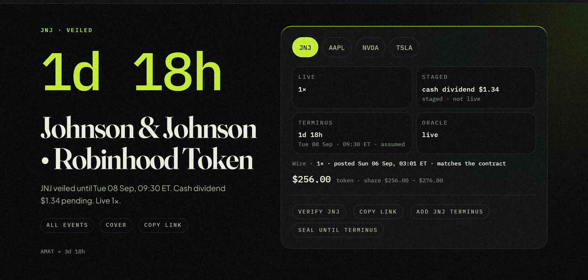

# Terminus Veil

[](https://github.com/terminusveil/terminusveil/actions/workflows/ci.yml)

The corporate-actions desk for Robinhood Chain stock tokens. Read-only, free, no wallet.

Site: https://www.terminusveil.app · X: [@terminus_veil](https://x.com/terminus_veil) · How it works: [ARCHITECTURE.md](ARCHITECTURE.md)



*The plate of one name as read on 7 September 2026. The Wire line at the bottom is the desk's own post on Robinhood Chain, compared against the contract on every refresh.*

## What it reads

Every stock token on Robinhood Chain carries a multiplier. A split or a reinvested dividend rewrites it: the next value is staged on the contract as `newUIMultiplier` with an `effectiveAt` stamp, and until that moment the staged figure is not the live one. For every name the desk reads, from the contract, on every refresh:

| Read | Selector | On the plate |
|---|---|---|
| `uiMultiplier()` | `0xa60bf13d` | live × |
| `newUIMultiplier()` | `0xdc767007` | staged × |
| `effectiveAt()` | `0x97a4064f` | terminus |
| `oraclePaused()` | `0x7706ba52` | oracle |
| `paused()` | `0x5c975abb` | transfers |

The site calls the first four "four reads"; `paused()` is the transfer pause printed beside them. The issuer's pending actions come from Robinhood's public corporate-actions feed and are grouped by process date. When the feed names no time, the plate says `assumed`. Every figure links to the explorer.

## Phases

| Phase | Status | What |
|---|---|---|
| 0 Desk | live | The reads above, events by date, calendar export, windows (the pons launches that name a ticker as their pair asset and the Uniswap v4 pools that hold it), public API. |
| 1 Wire | live | Every read the desk makes is posted to `TerminusWire` on Robinhood Chain. The plate says whether the post still matches the contract. |
| 2 Key | next | Alert before terminus, webhook and API feed, synced covering. Opened by a pass paid in $VEIL; a share of every pass burns. |
| 3 Matcher | vision | Not designed. |

$VEIL is not launched. Its address appears on `/token` first, then on X. Anything else is not us.

## Verify a plate yourself

1. Take the token address from the ticker page.
2. `eth_call` the selectors above against the public RPC, `https://rpc.mainnet.chain.robinhood.com`, chain id 4663. Multipliers are 18-decimal fixed point; `1000000000000000000` is 1×.
3. For the Wire, call `latest(poster, ticker)` on `0x08Cb2D14e80DD6f8E258A140d9d55519B5E0D916` with the poster printed on `/status`; the ticker is the symbol as `bytes32`. Compare with the plate's `Wire ·` line.

## Public reads

`/api/health`, `/api/pending`, `/api/ticker/{ticker}`, `/api/desk` (the whole desk as the pages receive it), `/api/tape`, `/api/calendar` (ICS), `/api/openapi.json`. No key, no limit beyond the edge cache.

## Run it

Node 22.

```bash
npm ci
npm run dev
```

`.env.example` lists the variables. `.env` is committed and carries only the public origin; do not copy the example over it. Put your own values in `.env.local`, which is ignored and read by the dev server and the build (`npm run windows` and `npm run snapshot` take `TERMINUS_RPC_URL` from the shell). Without `TERMINUS_RPC_URL` the desk reads the public RPC. `WIRE_POSTER_KEY` is only for the poster job and never belongs in a file.

```bash
npm test
npm run typecheck
npm run build
```

## Contracts

`contracts/` is a Hardhat project. `TerminusWire` (deployed, source verified on the explorer) and `VeilPass` (tested, not deployed) with their tests. `contracts/README.md` explains both, plainly. `contracts/deploy-page` is a localhost page that deploys from a browser wallet; no key ever touches a file.

## Read more

- [ARCHITECTURE.md](ARCHITECTURE.md), how the desk reads, decides and writes.
- [CHANGELOG.md](CHANGELOG.md), the same changelog the site prints at `/changelog`.
- [contracts/README.md](contracts/README.md), the Wire and the Pass, plainly.
- [SECURITY.md](SECURITY.md), how to report something wrong.

## Source availability

This repository is a snapshot mirror of the private working repository: each commit is one published state, authored by the house. It is published so that anyone can read and audit what the site runs. No license is granted for the site's code, see [LICENSE.md](LICENSE.md); the contracts carry their own SPDX identifier (MIT). Fonts are under the SIL Open Font License, see [FONTS.md](FONTS.md). Issues are read and answered; nothing is merged here, every change lands in the working repository first.

Independent. Not affiliated with or endorsed by Robinhood Markets, Inc. Not affiliated with pons.
